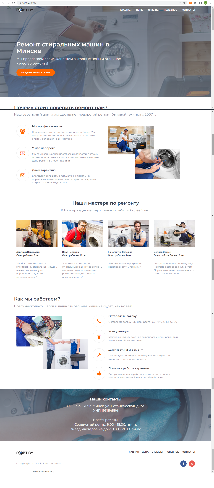

<!-- PROJECT LOGO -->
 

  

  <h3 align="center">Сайт для сервиса по ремонту стиральных машин ООО "РОБТ"</h3>

## О проекте

Сайт выполнен для продвижения услуг сервиса по ремонту стиральных машин в Минске при помощи:

- Python 3.10
- Django 4.1

Состоит из следующих страниц:

1. _Главная страница._ Здесь представлена информация о принципах работы фирмы и ее сотрудниках.
2. _Цены._ Информация о видах поломок и примерной стоимости ремонта.
3. _Отзывы._ На данной странице находится форма, с помощью которой можно оставить отзыв о работе компании, которые сразу публикуются на этой же странице. На email компании приходит оповещение о новом отзыве после публикации. 
4. _Полезное_. Различные статьи о выборе, эксплуатации и ремонте стиральных машин. Статьи загружаются через админку.
5. _Контакты._ Контакты компании, интерактивная яндекс-карта, форма для получения бесплатной консультации о поломке. Оповещение о заявке приходит на email компании.

## Контакты

Мой email - [kat.belyaeva.it@gmail.com](kat.belyaeva.it@gmail.com)

Ссылка на проект: [https://github.com/KatBelyaeva/SiteRobt](https://github.com/KatBelyaeva/SiteRobt)

(<a href="#readme-top">back to top</a>)

